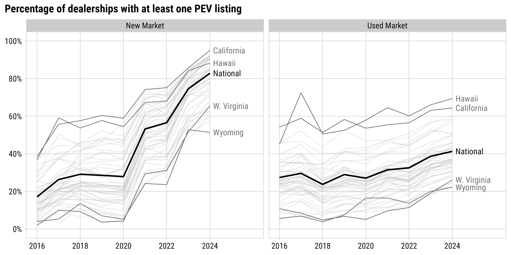
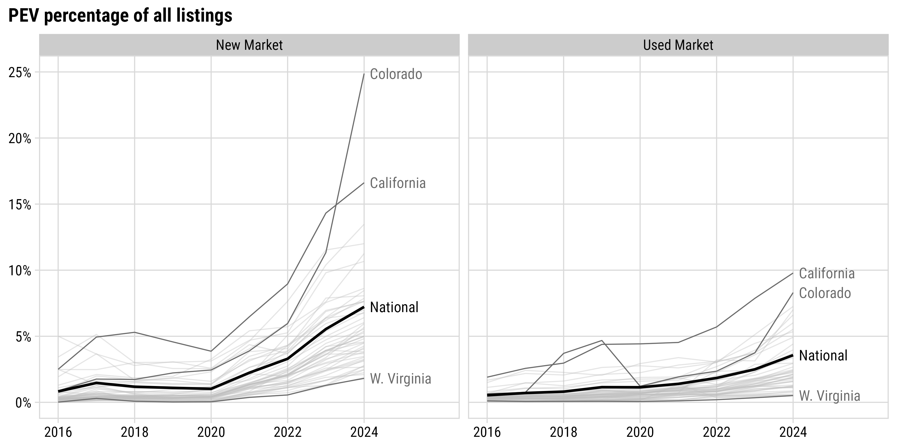
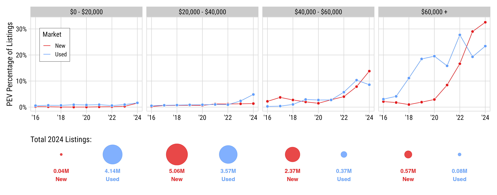
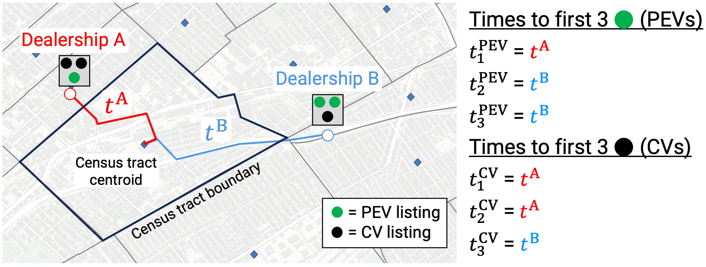
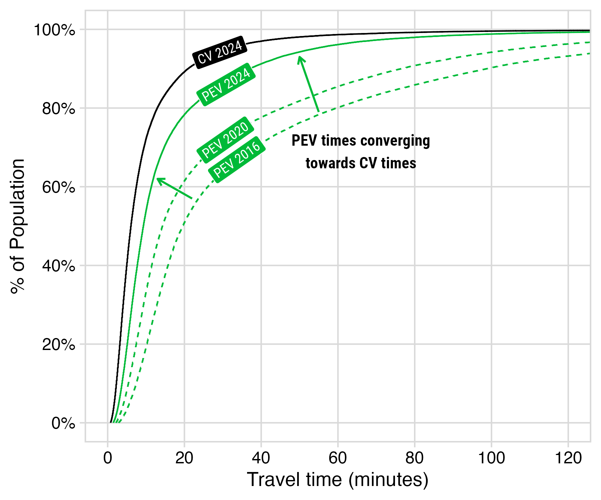
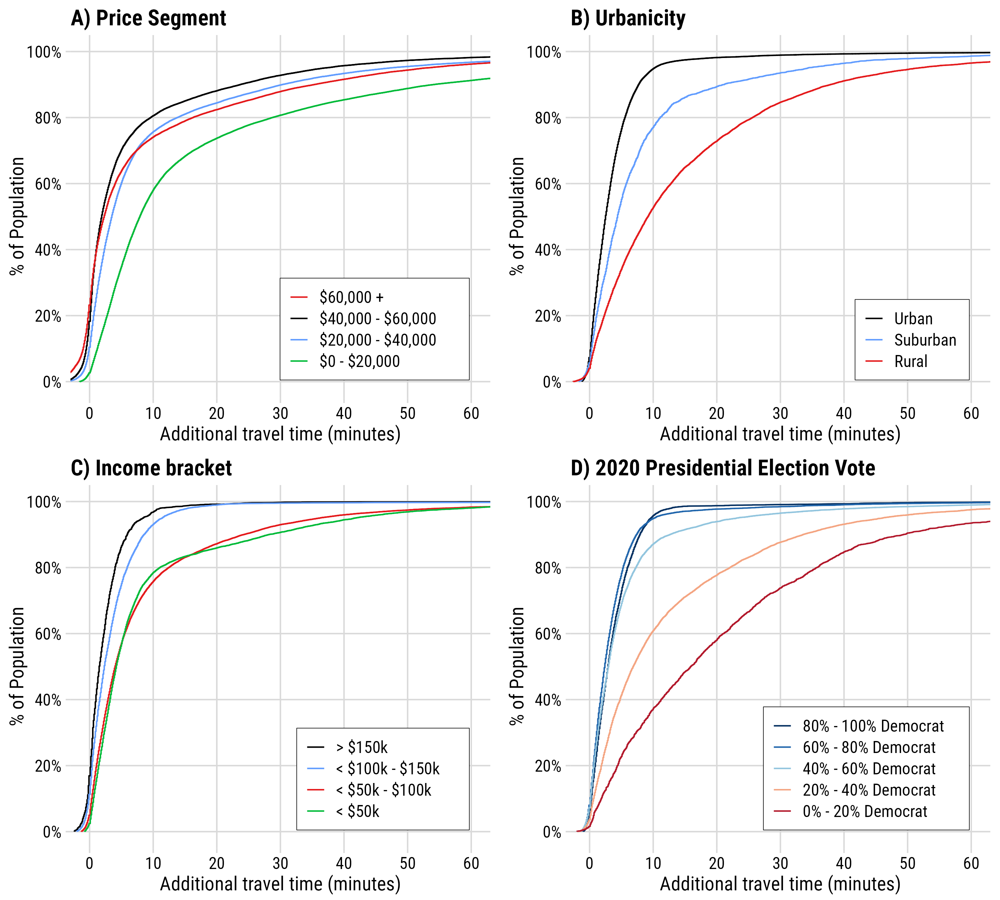
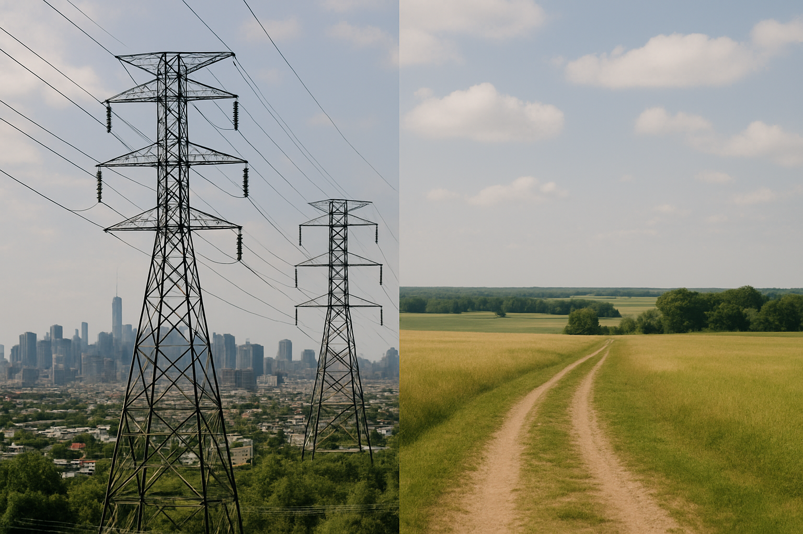
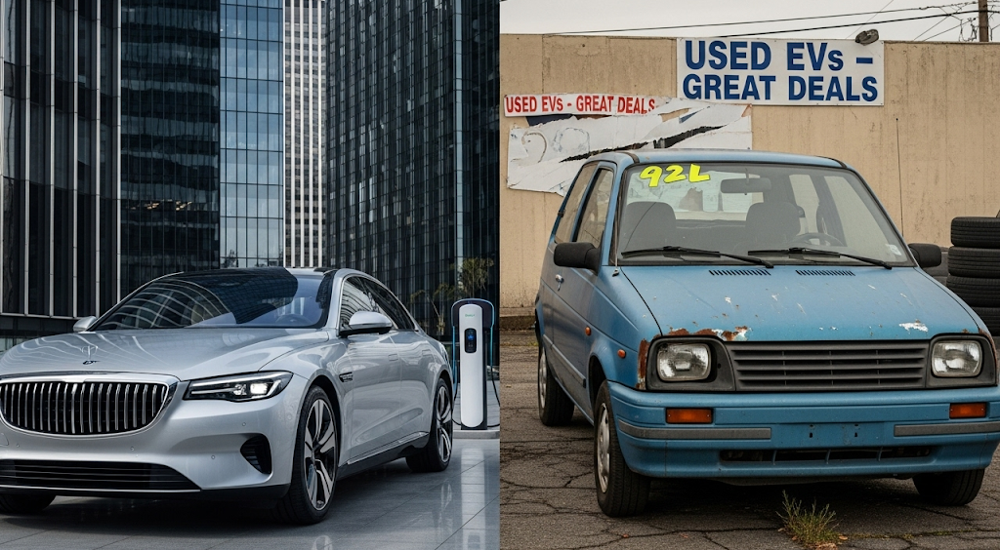

```{r setup, include=FALSE}
library(knitr)
library(fontawesome)
library(tidyverse)
library(metathis)
library(kableExtra)
library(here)

options(
    htmltools.dir.version = FALSE,
    knitr.table.format = "html",
    knitr.kable.NA = '',
    dplyr.width = Inf,
    width = 250
)
knitr::opts_chunk$set(
    warning = FALSE,
    message = FALSE,
    fig.path = "figs/",
    fig.width = 7.252,
    fig.height = 4,
    comment = "#>",
    fig.retina = 3
)

# Setup xaringanExtra options
xaringanExtra::use_xaringan_extra(c(
  "tile_view", "panelset", "share_again"))
xaringanExtra::style_share_again(share_buttons = "none")
xaringanExtra::use_extra_styles(
  hover_code_line = TRUE,
  mute_unhighlighted_code = FALSE
)

# Set up website metadata
meta() %>%
  meta_general(
    description = rmarkdown::metadata$subtitle,
    generator = "xaringan and remark.js"
  ) %>%
  meta_name("github-repo" = "jhelvy/2025-btr7-ev-spatial") %>%
  meta_social(
    title = rmarkdown::metadata$title,
    url = "https://jhelvy.com/slides",
    og_type = "website",
    og_author = "John Paul Helveston",
    twitter_card_type = "summary_large_image",
    twitter_creator = "@johnhelveston"
  )

# Vehicle listings summary table
summary_dt_raw <- read_csv(here('data', 'listings_summary.csv'))
total_listings <- sum(summary_dt_raw$n) / 10^6
summary_dt <- summary_dt_raw %>% 
    mutate(
        n = scales::comma(n), 
        vehicle_type = ifelse(vehicle_type == 'car', 'Car', 'SUV')
    ) %>% 
    pivot_wider(
        names_from = powertrain,
        values_from = n
    ) %>% 
    select(
        Type = vehicle_type,
        Conventional = conventional, 
        Hybrid = hev, 
        PHEV = phev, 
        BEV = bev, 
        inventory_type
    ) %>% 
    mutate(PHEV = ifelse(is.na(PHEV), 0, PHEV)) %>% 
    rename(CV = Conventional, HEV = Hybrid)
```

background-image: url("images/blue.jpg")
background-size: cover
class: inverse

<br><br><br><br>

## `r rmarkdown::metadata$title`

**.white[John Paul Helveston]**, George Washington University<br>
Lujin Zhao, George Washington University<br>
Michael Mann, George Washington University<br>

`r rmarkdown::metadata$date`

---

class: middle, center

## Addressing the **“innovation-needs paradox”**:

## The people most likely to benefit from a technology<br>are often the last ones to adopt it.

---

class: center
background-color: #fff

### .center[**Data**: `r round(total_listings, 1)`M vehicle listings from ~60k dealerships (marketcheck.com)<br>(2016 - 2024, inclusive)]

#### New Vehicles

```{r}
#| echo: false

summary_dt %>%
    filter(inventory_type == 'new') %>% 
    select(-inventory_type) %>% 
    kbl() 
```

#### Used Vehicles

```{r}
#| echo: false

summary_dt %>%
    filter(inventory_type == 'used') %>% 
    select(-inventory_type) %>% 
    kbl() 
```

---

class: inverse, middle, center

# How many dealerships are carrying PEVs?

---

class: center

## **4/5** dealers have _new_ BEV; **2/5** dealers have _used_ BEV

<center>

</center>

---

class: center

## PEVs still a small % of overall listings (7% new, 4% used)

<center>

</center>

---

class: center

## PEV affordability still a major challenge<br>**Majority of growth in high-price segments**

<center>

</center>

---

class: inverse, middle, center

# How hard is it to get to a PEV dealer?

---

background-color: #fff

### **Vehicle accessibility metric**:<br>Road travel time from census tract centroid to<br>nearest dealership with a target vehicle

<center>

</center>

*Road travel times obtained using Open Source Routing Machine (OSRM)

---

class: middle

.leftcol65[

<center>

</center>

]

.rightcol35[

## PEV travel times are converging towards conventional vehicle times

80% of pop:

- CV in ~12 min
- PEV in ~22 min (2024)
- PEV in ~60 min (2016)

]

---

class: middle

.leftcol65[

<center>

</center>

]

.rightcol35[

### Additional travel times (PEV - CV) by demographic blocks shows disparities

Places with worse PEV access:

- Lower income areas 
- Rural areas
- Republican strongholds

]

---

class: middle, center
background-color: #fff

.leftcol70[

<center>

</center>

]

.rightcol30[

### “PEV Deserts” exist in some areas, particularly in <$20,000 price range

]

---

class: middle, center
background-color: #fff

## **Key Finding**: EV accessibility is spatially concentrated

### Transportation electrification will be **geographically clustered** rather than evenly distributed

<center></center>

---

## .center[Grid planning must account for<br>**uneven adoption patterns**]

.center[Leveraging vehicle _listings_ can be useful for high-resolution planning]

.leftcol[

.center[**Concentrated demand**]

- Urban, higher-income areas
- Requires targeted grid investments
- Peak demand challenges

]

.rightcol[

.center[**Missed opportunities**]

- Rural wind resources underutilized
- Limited distributed load balancing
- Reduced renewable integration potential

]

---

## .center[**Affordability gap** limits mass-market electrification]

### - Only **1.3%** of new vehicles under $40k are EVs
### - **94%** of used market is under $40k with minimal EV options

<center></center>

---

## .center[**Dealerships matter** for the energy transition]

### - Direct experience increases willingness to adopt<br>.gray[(Roberson & Helveston, 2020; Agrawal et al., 2022)]
### - Geographic barriers limit consumer exposure

.leftcol55[

- 60+ minute travel penalties in rural areas
- Abundant conventional options nearby
- Limited EV education opportunities

]

.rightcol45[

<center></center>

]

---

class: inverse 
background-image: url("images/blue.jpg")
background-size: cover

<br><br><br><br><br><br><br><br><br><br>

# Thanks!

### Slides:

### https://slides.jhelvy.com/2025-btr7-ev-spatial/

.footer-large[.white[.right[

@jhelvy.bsky.social `r fa(name = "bluesky", fill = "white")`<br>
@jhelvy `r fa(name = "github", fill = "white")`<br>
jhelvy.com `r fa(name = "link", fill = "white")`<br>
jph@gwu.edu `r fa(name = "paper-plane", fill = "white")`

]]]

---

class: inverse, middle, center

# Extra Slides

---

## .center[**Policy coordination** needed for equitable transition]

<br>

### .center[Current patterns reinforce existing inequalities]

.leftcol[

.center[**Expand access**]

- Direct-to-consumer sales
- Rural dealership incentives
- Charging infrastructure investment

]

.rightcol[

.center[**System benefits**]

- More distributed demand
- Better renewable integration
- Grid stability support

]
